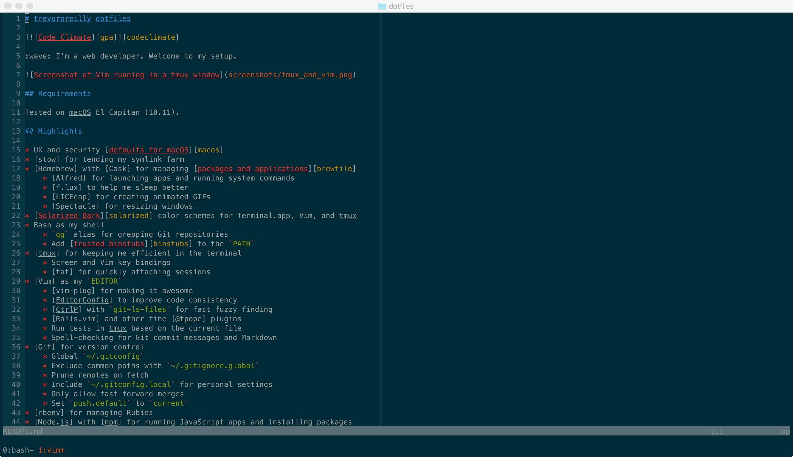

# trevororeilly dotfiles

[![Code Climate][gpa]][codeclimate]

:wave: I'm a web developer. Welcome to my setup.



## Requirements

Tested on macOS El Capitan (10.11).

## Highlights

* UX and security [defaults for macOS][macos]
* [stow] for tending my symlink farm
* [Homebrew] with [Cask] for managing [packages and applications][brewfile]
    * [Alfred] for launching apps and running system commands
    * [f.lux] to help me sleep better
    * [LICEcap] for creating animated GIFs
    * [Spectacle] for resizing windows
* [Solarized Dark][solarized] color schemes for Terminal.app, Vim, and tmux
* Bash as my shell
    * `gg` alias for grepping Git repositories
    * Add [trusted binstubs][binstubs] to the `PATH`
* [tmux] for keeping me efficient in the terminal
    * Screen and Vim key bindings
    * [tat] for quickly attaching sessions
* [Vim] as my `EDITOR`
    * [vim-plug] for making it awesome
    * [EditorConfig] to improve code consistency
    * [CtrlP] with `git-ls-files` for fast fuzzy finding
    * [Rails.vim] and other fine [@tpope] plugins
    * Run tests in tmux based on the current file
    * Spell-checking for Git commit messages and Markdown
* [Git] for version control
    * Global `~/.gitconfig`
    * Exclude common paths with `~/.gitignore.global`
    * Prune remotes on fetch
    * Include `~/.gitconfig.local` for personal settings
    * Only allow fast-forward merges
    * Set `push.default` to `current`
* [rbenv] for managing Rubies
* [Node.js] with [npm] for running JavaScript apps and installing packages
* [PostgreSQL] for storing relational data

## Installation

I clone the repository to my machine.

```sh
git clone git@github.com:trevororeilly/dotfiles.git
```

And run the [setup script][setup].

```sh
bin/setup
```

It can safely be run multiple times to update the environment.

## Contributing

See the [contributing] document for information on how to
participate.

## Acknowledgements

I'm grateful to the authors of related projects for sharing their work.

* [croaky/dotfiles][croaky]
* [mathiasbynens/dotfiles][mathiasbynens]
* [thoughtbot/laptop][thoughtbot]

## License

Released under the [MIT License](LICENSE).

[@tpope]: https://github.com/tpope
[Alfred]: https://www.alfredapp.com
[Cask]: https://caskroom.github.io
[CtrlP]: https://github.com/kien/ctrlp.vim
[EditorConfig]: http://editorconfig.org
[Git]: https://git-scm.com
[Homebrew]: http://brew.sh
[LICEcap]: http://www.cockos.com/licecap
[Node.js]: https://nodejs.org
[PostgreSQL]: https://www.postgresql.org
[Rails.vim]: https://github.com/tpope/vim-rails
[Spectacle]: https://www.spectacleapp.com
[Vim]: http://www.vim.org
[binstubs]: https://twitter.com/tpope/status/165631968996900865
[brewfile]: Brewfile
[codeclimate]: https://codeclimate.com/github/trevororeilly/dotfiles
[contributing]: CONTRIBUTING.md
[croaky]: https://github.com/croaky/dotfiles
[f.lux]: https://justgetflux.com
[gpa]: https://codeclimate.com/github/trevororeilly/dotfiles/badges/gpa.svg
[macOS]: bin/macos
[mathiasbynens]: https://github.com/mathiasbynens/dotfiles
[npm]: https://www.npmjs.com
[rbenv]: https://github.com/rbenv/rbenv
[setup]: bin/setup
[solarized]: http://chriskempson.github.io/base16/#solarized
[stow]: https://www.gnu.org/software/stow
[tat]: stowage/.bin/tat
[thoughtbot]: https://github.com/thoughtbot/laptop
[tmux]: https://tmux.github.io
[vim-plug]: https://github.com/junegunn/vim-plug
